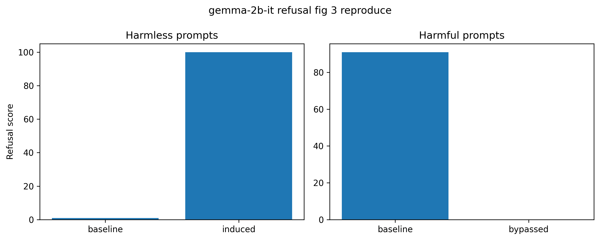

# Refusal Direction in LLMs

Reproduction of the paper  
**"Refusal in Language Models Is Mediated by a Single Direction"**  
https://arxiv.org/pdf/2406.11717

## Overview

This project reproduces the main experiment (Figure 3 in Section 3) from *Refusal in Language Models Is Mediated by a Single Direction*.

The paper proposes that refusal behavior in large language models is mediated by a **single direction in the residual stream**. By extracting this direction and performing causal interventions, refusal behavior can be either induced or suppressed.

This repository reproduces the experiment described in the paper.

## Method

The experiment follows the procedure described in the paper:

1. Extract residual stream representations from harmful and harmless prompts (Table 6)
2. Compute candidate refusal directions by taking the difference of the mean representations (Section 2.3)
3. Select the optimal direction using bypass / induce scores following the selecting algorithm in the paper (Appendix B and C)
4. Perform causal interventions by adding or ablating the direction during the forward pass (Section 2.4)

## Result

The optimal refusal direction induces refusal behavior on harmless prompts and suppresses refusal behavior on harmful prompts, reproducing the key finding of the paper.

## Interpretation

Adding the refusal direction causes harmless prompts to trigger refusal responses, while removing the direction suppresses refusal behavior on harmful prompts.

These results support the hypothesis that refusal behavior is mediated by a single direction in the residual stream.

## Code

The full reproduction is implemented in the notebooks/refusal_direction_reproduction.ipynb.

## Environment

Google Colab (T4 GPU)
Dependencies are installed directly in the notebook.
Environment last verified: 2026-03-07

## Reference

Arditi, A., et al.  
*Refusal in Language Models Is Mediated by a Single Direction*  
https://arxiv.org/pdf/2406.11717